# Path Tracer y Photon Mapper

Motores de renderizado 3D que simulan la iluminación global mediante técnicas de **Path Tracing** y **Photon Mapping**.

Soporta luces puntuales y de área, materiales con efectos de reflexión y refracción, y escenas personalizadas.

## Autores
- Boleslaw Wozniak, Dorian
- Seral Gracia, Álvaro

## Path Tracer

### Escena con varios planetas y un cohete de distintos materiales, con una luz puntual y varias de área

  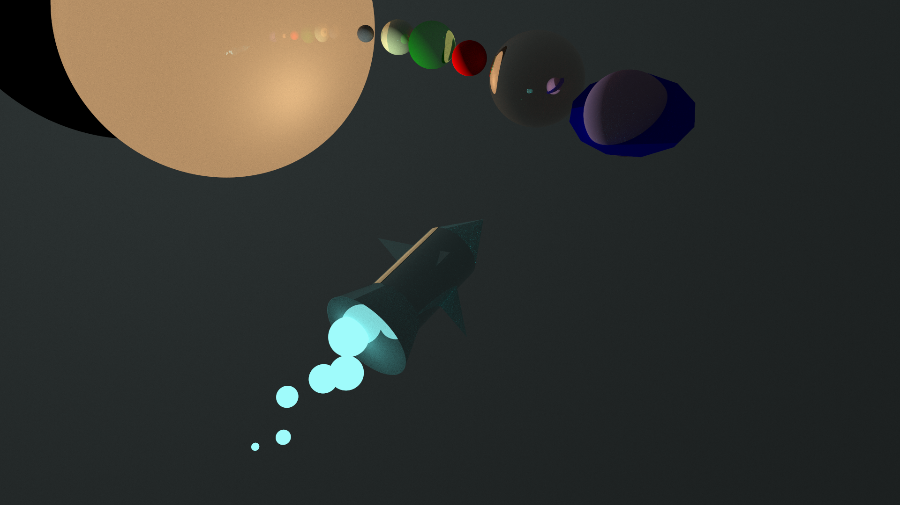

### Escena con varios juguetes de distintos materiales, con una luz puntual

  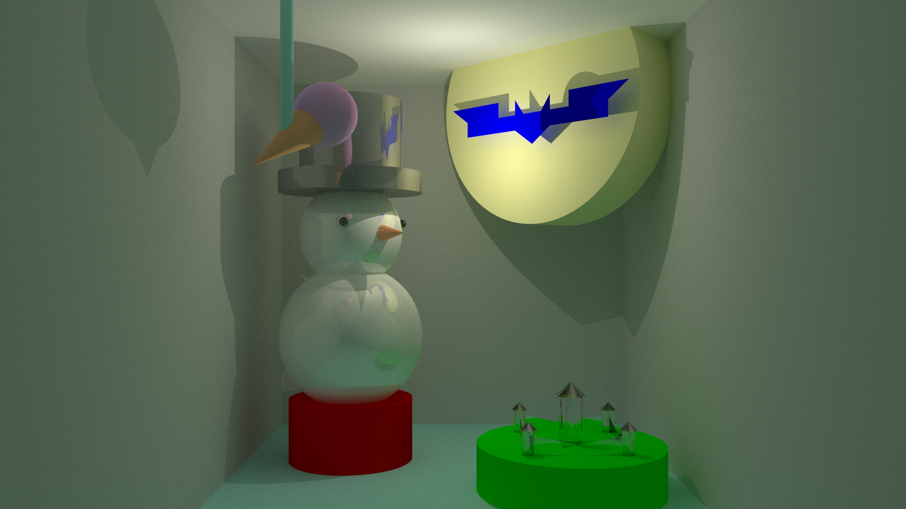

### Cornell Box con dos esferas difusas
En la izquierda, con una luz puntual; en la derecha, con una luz de área.

  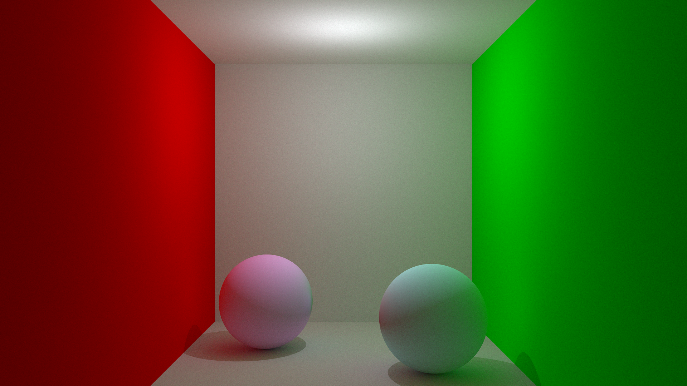
  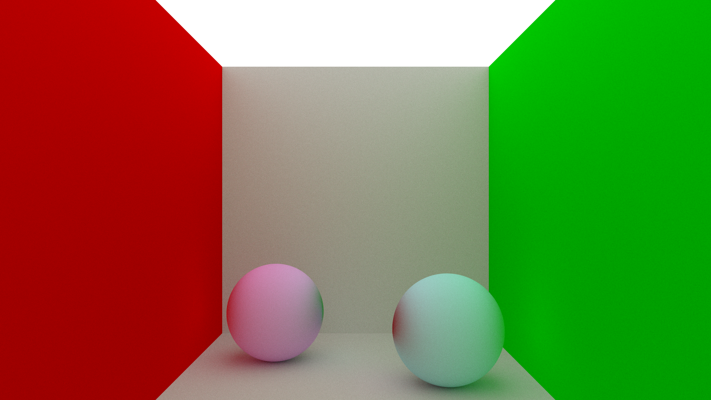

### Cornell Box con una esfera plástica y una dieléctrica
En la izquierda, con una luz puntual; en la derecha, con una luz de área.

  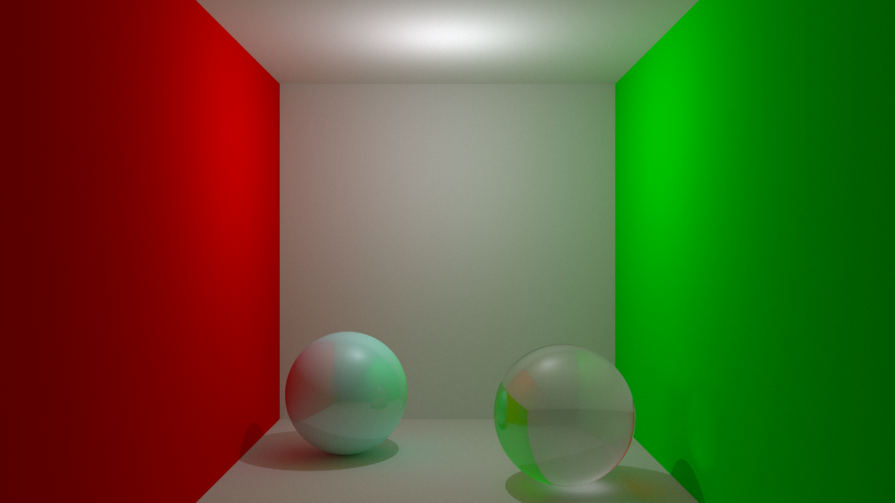
  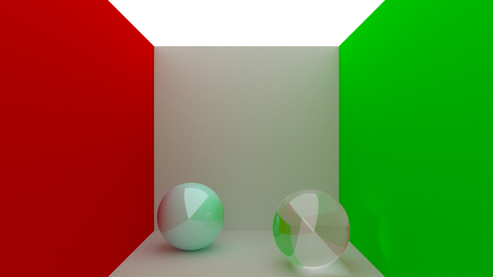

### Otras geometrías
En la izquierda, con cilindros finitos; en el centro, con conos finitos; en la derecha, con polígonos convexos personalizados.

  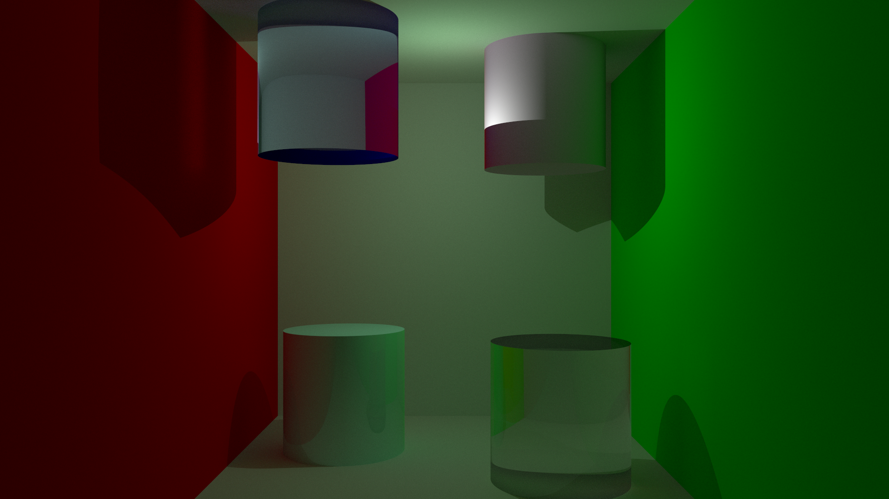
  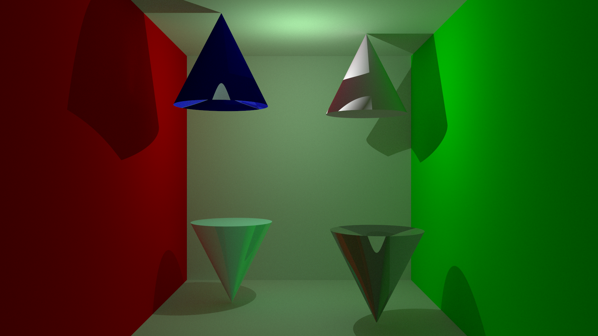
  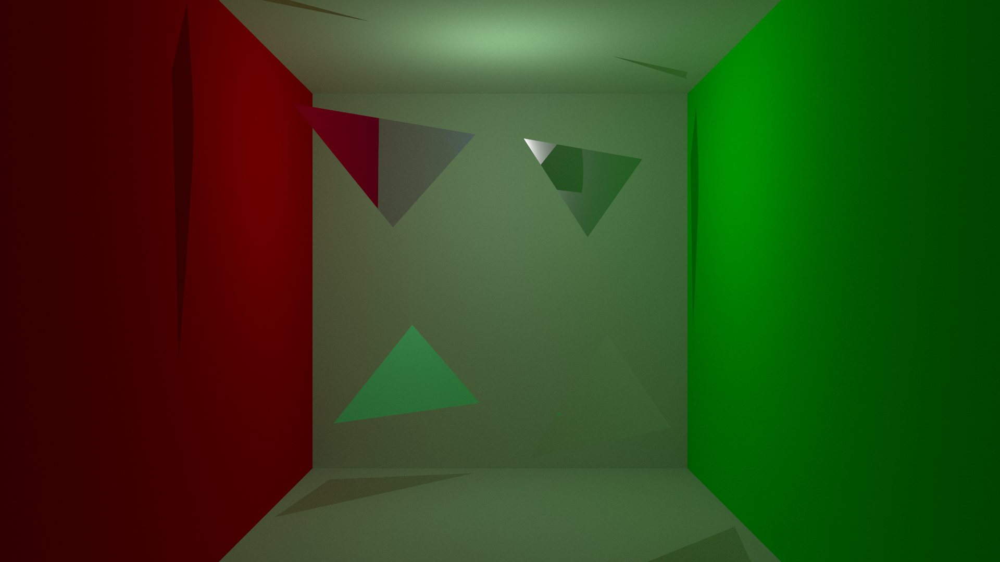

### Profundidad de campo
En la izquierda, con una apertura de cámara de 0.3 y una distancia focal enfocando la esfera más cercana; en la derecha, con una apertura de cámara de 0.6 y una distancia focal enfocando la esfera más cercana.

  
  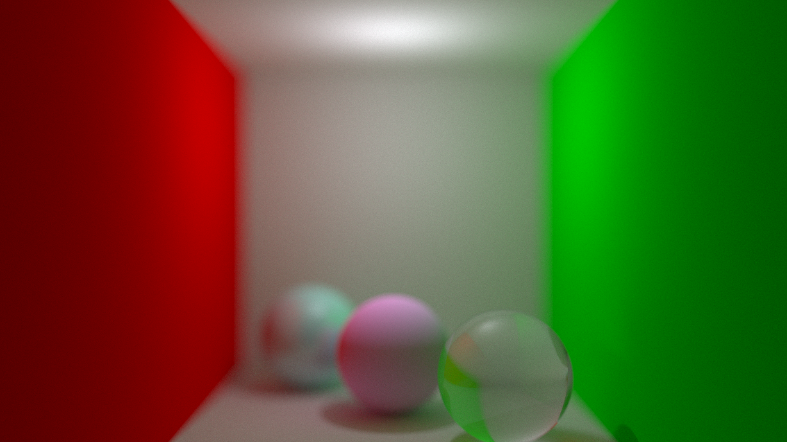

## Photon Mapper

### Escena con varios juguetes de distintos materiales, con Next Event Estimation

  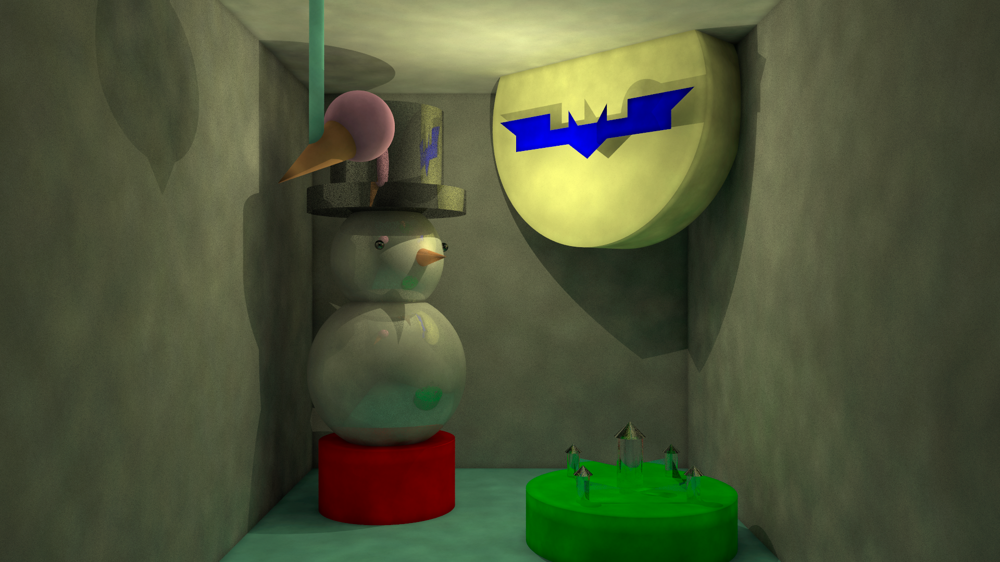

### Escena con varios juguetes de distintos materiales, sin Next Event Estimation

  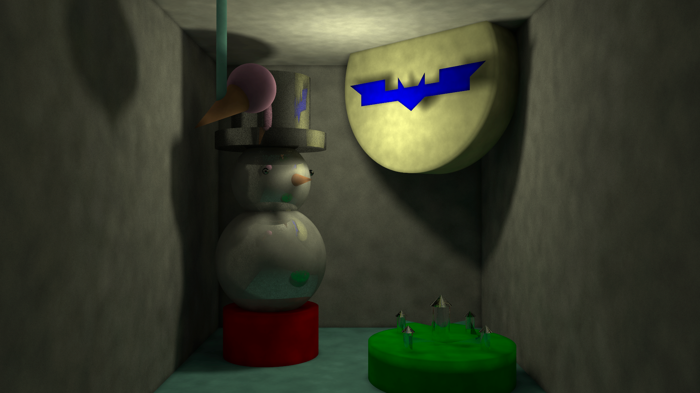

### Cornell Box con dos esferas difusas
En la izquierda, sin Next Event Estimation; en la derecha, con Next Event Estimation.

  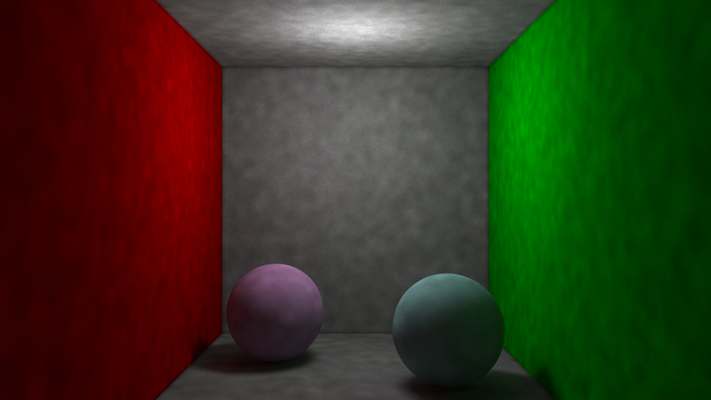
  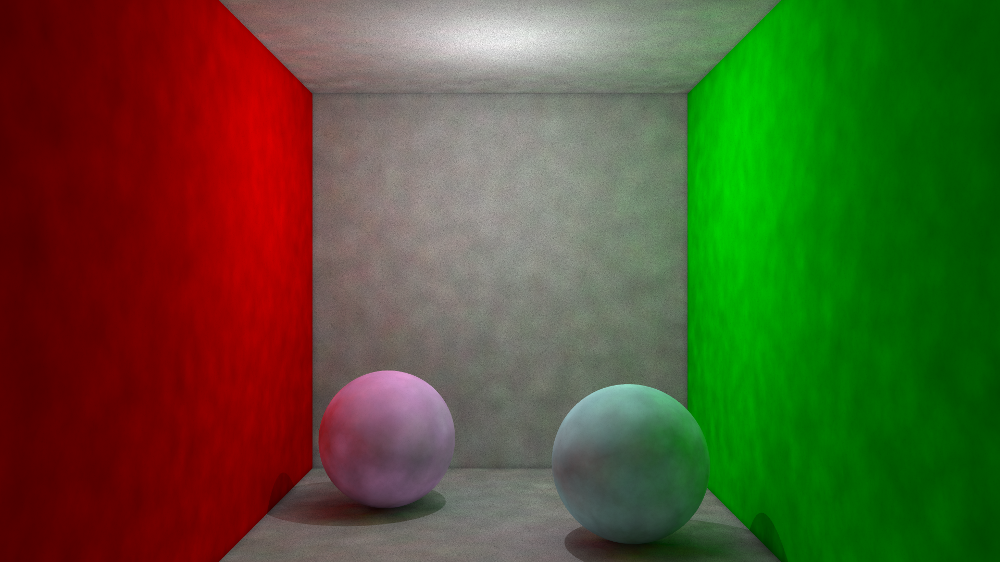

### Cornell Box con una esfera plástica y una dieléctrica
En la izquierda, sin Next Event Estimation; en la derecha, con Next Event Estimation.

  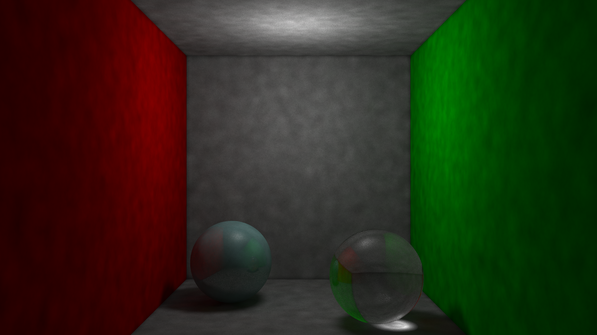
  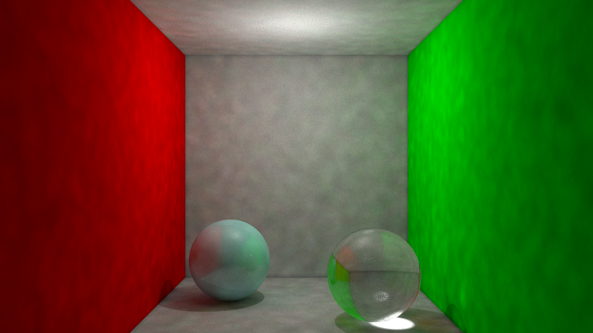

### Filtrado de fotones por superficie
En la izquierda, no se filtran los fotones; en la derecha, sí se filtran los fotones.

  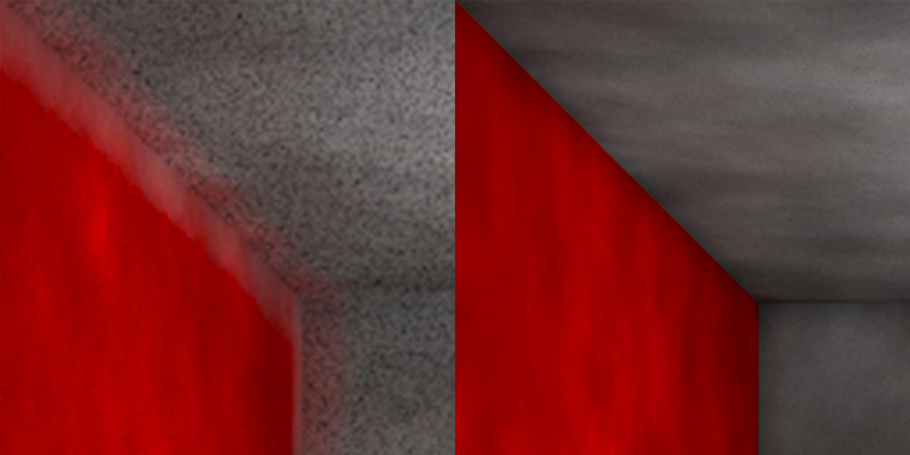

### Kernels sofisticados
En la fila de arriba se encuentra la imagen relativa al kernel Uniforme como base para comparar el resto.  
En la fila de abajo, por orden de izquierda a derecha: kernels Triangular, Epanechnikov, Gaussiano
y Coseno.

  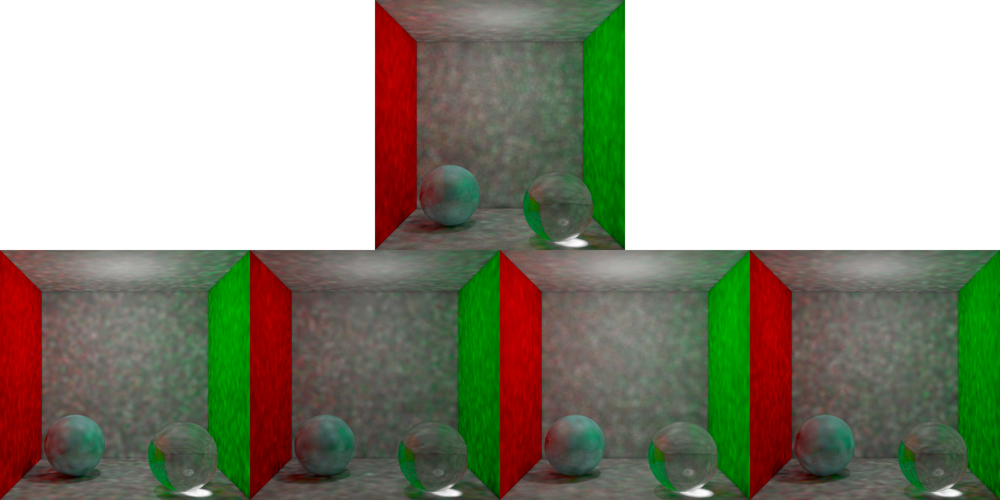

